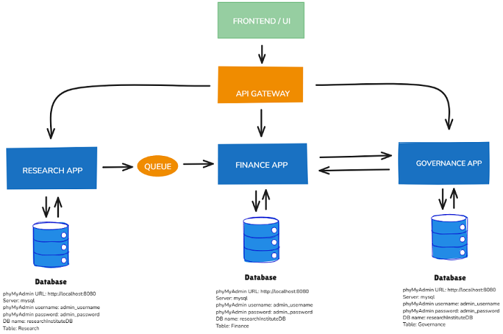

# Table of contents
1. [Project Description](#description)
2. [Installation](#installation)
3. [Usage](#usage)
4. [Features](#features)
5. [Screenshots](#screenshots)
6. [Documentation](#documentation)
7. [License](#license)

## 1. Project Description <a name="description"></a>

In previous projects, I used a **monolithic architecture** to build web applications. 

In this project, I use a **microservice architecture** to build a Laravel web application.

In this application, a researcher affiliated with one of the four Research Institute departments applies for a research grant. The Finance department checks with the Governance department: If the yearly budget allocated for research projects in this department can cover the grant, the grant is approved. If it cannot, the grant is rejected.

My Laravel web application is built on top of  three microservices:

1. A **Governance** microservice application
2. A **Research** microservice application
3. A **Finance** microservice application

To understand how the three microservices work with one another, I encourage you to look at: 

1. the [**Screenshots**](#screenshots) section below 
2. the [**Usage**](#usage) section below which contains the project REST API verbs and their description

A microservice architecture based application requires **queues** (of the type **"direct exchange queues"** in our case) when (1) the **publisher** publishes a message and (2) **the consumer** consumes that message.

A number of tools are necessary in order to build a Laravel microservices architecture based application.

Please refer to the [**Documentation**](#documentation) section below to view and access each of the references listed below.

&nbsp;&nbsp;&nbsp;&nbsp;&nbsp;&nbsp;**[Ref. 1]** *Laravel Sail:  Laravel's default Docker development environment*

&nbsp;&nbsp;&nbsp;&nbsp;&nbsp;&nbsp;**[Ref. 2]** *A complete guide to Laravel Sail*

&nbsp;&nbsp;&nbsp;&nbsp;&nbsp;&nbsp;**[Ref. 3]** *Adding phpMyAdmin to Sail Docker compose*

&nbsp;&nbsp;&nbsp;&nbsp;&nbsp;&nbsp;**[Ref. 4]** *RabbitMQ Queue driver for Laravel*

## 2. Installation <a name="installation"></a>

1. Make a new directory, open a bash console in that  directory and  clone the repository:

&nbsp;
`git clone https://github.com/KB-WEB-DEVELOPMENT/research-grant-app.git`

2. Go to each directory (/finance, /governance, /research) and in the terminal, run each time:

&nbsp;&nbsp;&nbsp;&nbsp;&nbsp;&nbsp;&nbsp;&nbsp;&nbsp;
`composer install` 

3. Go to the  /research directory and in the terminal, run:

&nbsp;&nbsp;&nbsp;&nbsp;&nbsp;&nbsp;&nbsp;&nbsp;&nbsp;
`composer require vladimir-yuldashev/laravel-queue-rabbitmq`

4. Copy the three existing .env.example files to three new .env files

>Note: The three .env.example files (Governance/.env.example, Finance/.env.example and Research/.env.example) already contain the configuration settings needed for the mysql database connection and RabbitMQ. 

&nbsp;&nbsp;&nbsp;&nbsp;&nbsp;&nbsp;&nbsp;&nbsp;&nbsp;You should adapt those settings to your development environment.

5. Go to each directory (/finance, /governance, /research) and in the terminal, run:

&nbsp;&nbsp;&nbsp;&nbsp;&nbsp;&nbsp;&nbsp;&nbsp;&nbsp;
`
php artisan key:generate
`

6. Use a database tool to create an empty database (the project default database name is 'researchInstituteDB' in .env.example)

7. Database migration

&nbsp;&nbsp;&nbsp;&nbsp;In the /finance directory, run in the terminal:


&nbsp;&nbsp;&nbsp;&nbsp;&nbsp;&nbsp;&nbsp;&nbsp;&nbsp;`php artisan migrate--path=/database/migrations/finance`


&nbsp;&nbsp;&nbsp;&nbsp;In the /governance directory, run in the terminal:


&nbsp;&nbsp;&nbsp;&nbsp;&nbsp;&nbsp;&nbsp;&nbsp;&nbsp;`php artisan migrate--path=/database/migrations/governance`


&nbsp;&nbsp;&nbsp;&nbsp;In the /research directory, run in the terminal:


&nbsp;&nbsp;&nbsp;&nbsp;&nbsp;&nbsp;&nbsp;&nbsp;&nbsp;`php artisan migrate--path=/database/migrations/research`


8. (Optional): Seed the database

&nbsp;&nbsp;&nbsp;&nbsp;In the /governance directory, run in the terminal:
    
&nbsp;&nbsp;&nbsp;&nbsp;&nbsp;&nbsp;&nbsp;&nbsp;&nbsp;`php artisan db:seed -–class=GovernanceSeeder`
	
&nbsp;&nbsp;&nbsp;&nbsp;In the /research directory, run in the terminal: 
	
&nbsp;&nbsp;&nbsp;&nbsp;&nbsp;&nbsp;&nbsp;&nbsp;&nbsp;`php artisan db:seed -–class=ResearchSeeder`
	
&nbsp;&nbsp;&nbsp;&nbsp;In the /finance directory, run in the terminal: 
	
&nbsp;&nbsp;&nbsp;&nbsp;&nbsp;&nbsp;&nbsp;&nbsp;&nbsp;`php artisan db:seed -–class=FinanceSeeder`
	
&nbsp;&nbsp;&nbsp;&nbsp;&nbsp;This will create four row entries in each table (Governance, Research and Finance).

9. Add phpMyAdmin service to Laravel Sail

>Follow [**Documentation**](#documentation) [[**Ref.3**]](#documentation) to add phpMyAdmin service to the project 'Research' directory of Laravel Sail docker-compose.yml file.

10. Start Laravel Sail

&nbsp;&nbsp;&nbsp;&nbsp;&nbsp;In the terminal, enter the command:

&nbsp;&nbsp;&nbsp;&nbsp;&nbsp;&nbsp;&nbsp;&nbsp;&nbsp;`./vendor/bin/sail up`

11. Start the local development server

&nbsp;&nbsp;&nbsp;&nbsp;&nbsp;&nbsp;In the terminal, run:

&nbsp;&nbsp;&nbsp;&nbsp;&nbsp;&nbsp;&nbsp;&nbsp;&nbsp;`php artisan serve`

&nbsp;&nbsp;&nbsp;&nbsp;&nbsp;&nbsp;If you seeded, say, the Governance database table (step 8 above), the following route should output json data:

&nbsp;&nbsp;&nbsp;&nbsp;&nbsp;&nbsp;&nbsp;&nbsp;&nbsp;**http://localhost:8000/api/governance-bugdets**

## 3. Usage <a name="usage"></a>

The project REST API verbs and their description:

|Verb|Path|Action|Description|
|:---------|:-|:-----|:-----|
|GET|api/governance-bugdets|index|display a list of all budgets details for each department|
|GET|api/governance-bugdets/{governance}|show|display all budget details of one specifc department|
|POST|api/governance-bugdets|store|create a new budget for one specific department|
|GET|api/research-applications|index|display a list of all research grant applications containing all research grant application details|
|GET|api/research-applications/{research}|show|display all details of one specific research grant application|
|POST|api/research-applications|store|create a new research grant application|
|GET|api/research-finance|index|display a list of all finance-related details related to each research grant application submitted|
|GET|api/research-finance/{finance}|show|display all finance-related details related to one specific research grant application submitted|
|PUT|api/research-finance/{finance}|update|update finance-related details related to one specific research grant application submitted|


## 4. Features <a name="features"></a>


1. Note that only **```one database```** and **```three tables```** are used in the project.

2. A researcher can only submit a grant application. A Governance employee can only create a row entry in the Governance table. A Finance employee can only update the 'staff_comment' field value in a row entry in the Finance table.

3. In a more complex project, researchers, Governance employees and Finance employees would have to authenticate themselves.

4. I used RabbitMQ to create two Laravel jobs which are queued: **```CreateFinanceJob```** and **```UpdateGovernanceJob```**

5. You can use <b><a href="https://www.postman.com/updivision/updivision-s-public-workspace/request/create?requestId=8bedc18b-0fa4-4021-baae-f7b961affe22" target="_blank">Postman</a></b> to test the API.

## 5. Screenshots <a name="screenshots"></a>

1. Application Flow Diagram

   <mark>**The three databases (Research Services DB, Governance Services DB and Finance Services DB) are actually the same database.**</mark>


2. Application Microservice Architecture



3. Relation between the Application tables (Database Schema)
 


## 6. Documentation <a name="documentation"></a>

[[**Ref. 1**]: **Laravel Sail  Documentation**](https://laravel.com/docs/11.x/sail "Laravel Sail  Documentation")

[[**Ref. 2**]: **A complete guide to Laravel Sail**](https://tech.osteel.me/posts/you-dont-need-laravel-sail "A complete guide to Laravel Sail")

[[**Ref. 3**]: **Adding phpMyAdmin to sail docker compose**](https://github.com/laravel/framework/discussions/48786 "Adding phpMyAdmin to sail docker compose")

[[**Ref. 4**]: **RabbitMQ Queue driver for Laravel**](https://github.com/vyuldashev/laravel-queue-rabbitmq/blob/master/README.md "RabbitMQ Queue driver for Laravel")

## 7. License <a name="license"></a>

The MIT License (MIT)

Copyright (c) <2024> Kâmi Barut-Wanayo

Permission is hereby granted, free of charge, to any person obtaining a copy
of this software and associated documentation files (the "Software"), to deal
in the Software without restriction, including without limitation the rights
to use, copy, modify, merge, publish, distribute, sublicense, and/or sell
copies of the Software, and to permit persons to whom the Software is
furnished to do so, subject to the following conditions:

The above copyright notice and this permission notice shall be included in
all copies or substantial portions of the Software.

THE SOFTWARE IS PROVIDED "AS IS", WITHOUT WARRANTY OF ANY KIND, EXPRESS OR
IMPLIED, INCLUDING BUT NOT LIMITED TO THE WARRANTIES OF MERCHANTABILITY,
FITNESS FOR A PARTICULAR PURPOSE AND NONINFRINGEMENT. IN NO EVENT SHALL THE
AUTHORS OR COPYRIGHT HOLDERS BE LIABLE FOR ANY CLAIM, DAMAGES OR OTHER
LIABILITY, WHETHER IN AN ACTION OF CONTRACT, TORT OR OTHERWISE, ARISING FROM,
OUT OF OR IN CONNECTION WITH THE SOFTWARE OR THE USE OR OTHER DEALINGS IN
THE SOFTWARE
